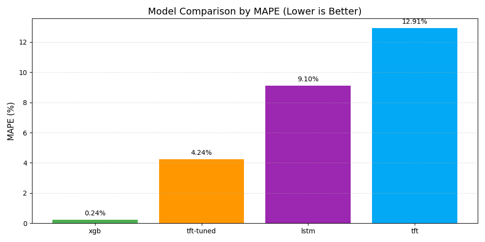

# ⚡ Electricity Load Forecasting

This project focuses on forecasting **hourly electricity demand** using multiple model families and comparing how they perform under **stable conditions** and during **regime shifts** (e.g., the COVID-19 period).  
The goal is to understand **which model is best suited for different real-world forecasting contexts**.

## 🎯 Objective

The project evaluates three time-series modeling approaches:

| Model Type | Model Used | Purpose |
|-----------|------------|---------|
| Tree-Based | **XGBoost** | Strong baseline for stable seasonal behavior |
| Sequence Model | **LSTM** | Learns week-long temporal patterns directly from sequences |
| Attention-Based Model | **Temporal Fusion Transformer (TFT)** | Handles multivariate relationships and adapts to regime shifts |

We compare how these models handle:

- Weekly and daily **seasonality**
- **Long-range temporal dependencies**
- **Structural changes** in demand behavior (e.g., COVID impact)

The goal is **not** to find a single “best” model, but to identify **which model is most appropriate for which operational scenario**.

---

## 📁 Project Structure

```
customer-churn-prediction/
│
├── 📁 data/                        # Data directory (add your data here)
│   ├── raw/                        # Raw data
│   └── worked/                     # Processed data
│
├── 📁 models/                      # Trained models & metrics
│   ├── LSTM/
│   ├── TFT/
|   |   └──finetuned
│   └── XGBoost/                 
│
├── 📁 notebooks/                
│   ├── 01_Data_Preparation_EDA.ipynb                      # Explains The data preparation for the models
│   ├── 02_XGBoost_Model_Training.ipynb                    # XGBoost model trainig
│   ├── 03_LSTM_Model_Training.ipynb                       # LSTM model training
│   ├── 04_TFT_Model_Training.ipynb                        # TFT/TFT-Tuned model training
│   └── 05_Conclusion_and_Model_Comparison.ipynb           # Comparison between models
│
├── 📁 reports/                     # Contains various plots of every step
│
├── 📁 src/
│   ├── data_prep.py                # Cleaning data
│   ├── EDA.py                      # Exploring the data with EDA
│   ├── evaluation.py               # Evaluation of the models trained
│   ├── feature_engineering.py      # Feature Engineering (lags, weather,....)
│   ├── LSTM_model_trainig.py       # Full LSTM model training pipeline 
│   ├── prepare_data_for_models.py  # Contains main functions to split data, transform data for models
│   ├── TFT_model_trainig.py        # TFT and TFT-Tuned full model training pipeline 
│   └── XGBoost_model_training.py   # Full XGBoost Regression model training pipeline
│
├── main.py                         # Quick access to EDA and model trainings
├── README.py                       # This file
└── requirements.txt                # Python dependencies

```

---

## 🛠 Tech Stack

| Category | Tools |
|---------|-------|
| Programming | Python |
| ML Frameworks | TensorFlow / Keras, PyTorch Lightning, XGBoost |
| Data Processing | pandas, NumPy, scikit-learn |
| Visualization | matplotlib, seaborn |
| Model Storage | joblib, JSON checkpoint saving |

---

## 🧹 Data Preparation & Feature Engineering


Key preprocessing steps:

- Handled missing timestamps and small gaps (forward-fill)
- Extracted time features: `hour`, `dayofweek`, `is_weekend`, `year`
- Created lag features to model short-, medium-, and long-term memory
- Compressed correlated weather variables into **3 PCA components**
- Scaled numeric features using **StandardScaler (fit on train only)** to avoid data leakage
- **COVID Impact Analysis**: Using a binary flag `covid_period`, I compared average pre-COVID vs post-COVID demand.


The final dataset includes **both contextual and temporal features**, suitable for tree-based, recurrent, and transformer models.

---

## 🤖 Models

### 1) XGBoost (Tree-Based)
- Learns from engineered lag and cyclical features
- Excellent baseline for stable demand with recurring seasonality

### 2) LSTM (Sequential Neural Network)
- 2 LSTM layers: **128 → 64 units**
- Dropout + L2 regularization
- Trained on **168-hour sliding windows** (one full week of context)

### 3) Temporal Fusion Transformer (TFT)
- Uses:
  - **Attention mechanisms**
  - **Gating**
  - **Variable selection layers**
- Initially struggled during COVID regime shift → **Fine-tuned** on recent data to adapt successfully

---

## 📊 Model Performance (Summary)

| Model | MAE ↓ | RMSE ↓ | MAPE ↓ | Interpretation |
|------|------|------|-------|----------------|
| **XGBoost** | Low | Low | Lowest | Best during stable seasonal behavior |
| **LSTM** | Medium | Higher | ~10% | Captures weekly structure, less precise overall |
| **TFT (initial)** | High | High | Struggled | Unable to generalize across COVID demand shift |
| **TFT (fine-tuned)** | Improved Significantly | Much Lower | ~5% | Successfully adapts to structural change |




---

## 📈 Visual Results

- Prediction vs. Actual overlays
- Error (residual) diagnostics
- Model comparison bar charts

All visuals are available in the repository’s **`reports/`** folder and inside the **Model Comparison Notebook**.

---

## 🚀 Run the Project

```bash
# Clone repository
git clone <https://github.com/Haseeb2510/Electricity-Load-Forecasting>

# Install dependencies
pip install -r requirements.txt

```

## 🛠 Run `main.py` for a quick overview of:

1. Evaluation
2. EDA
3. XGBoost model Training
4. LSTM model Training
5. TFT (Temporal Frusion Transformer) model Training

## 🤝 Contributing

Contributions are welcome! Please feel free to submit a Pull Request.

## 📄 License

This project is licensed under the MIT License - see the LICENSE file for details.

## 👨‍💻 Author

**Your Name**
- GitHub: [@Haseeb2510](https://github.com/Haseeb2510)
- LinkedIn: [Abdul Haseeb](https://www.linkedin.com/in/haseeb-abdul-172542243)

## 🎉 Acknowledgments

This project was made possible through the contributions of the open-source community and publicly available data resources.

Special thanks to:

- **Saurabh Shahane** and **Kaggle** for providing the Electricity Load Forecasting dataset, which served as the foundation for this project.
- **PyTorch Forecasting**, **TensorFlow/Keras**, and **XGBoost** teams for developing high-performance frameworks for sequence and tree-based modeling.
- **scikit-learn**, **Pandas**, and **NumPy** for their essential data processing, transformation, and evaluation utilities.
- **Matplotlib** and **Seaborn** for visualization tools that made analysis and interpretation clear.


Grateful to the open-source ecosystem for enabling accessible, reproducible, and high-quality machine learning development.
